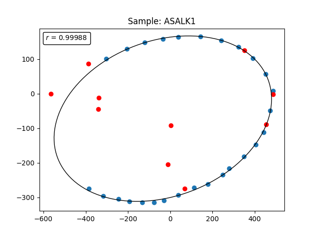
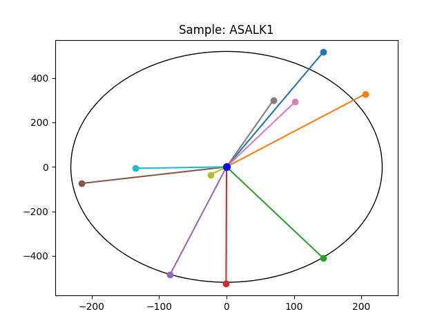
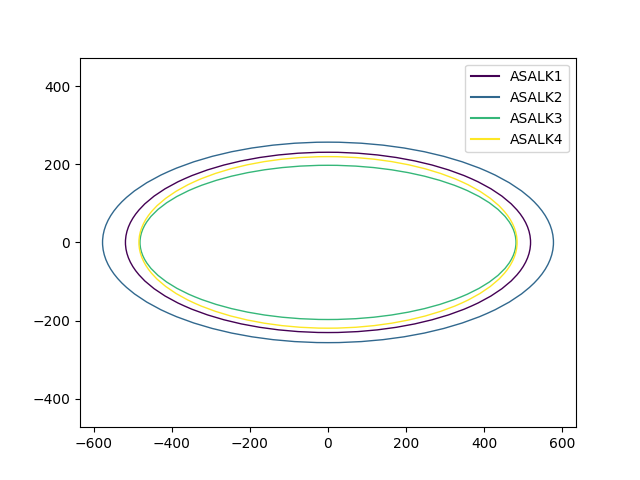

# `flylips`: Comparing _Drosophila_ wings using ellipses

## Background

It has been shown that _Drosophila_ wings can be resonably approximated by an ellipse 
(Klaczko & Bitner-Mathe 1990). From the ellipse, one can calculate the size and shape
of the wing, and allowing for easy comparison between different wings. Using this 
approach, it has been shown that various elements, such as sex, temperature, density,
lab-reared vs wild-caught, can affect the size and/or shape of the wing (Klaczko 2006).

Morever, it is possible to easily describe the "anchor" points of various characteristics
of interest, such as the extremeties of the wing veins in terms of angular coordinates.
In a polar coordinate system, we have the angular coordinate and the radial coordinate. 
Because these "anchor" points often fall on the fitted ellipse and 
we know the semi-major and semi-minor axes of the ellipse, we can easily calculate the 
radial coordinate from the angular coordinate (Klaczko 2006). This opens up the possibility
of using the angular coordinates to compare the placement of these "anchor" points across
different wings.

`flylips` is Python package that allows for easy fitting of the ellipse to at least 
six points along the edge of the wing. It also calculates the polar coordinates of 
ten "anchor" points of interest. Originally, the code for this project was written in 
ANSI BASIC.

## Installation

`flylips` requires Python 3.9 or later. It can be installed using `pip`:

```bash
pip install flylips
```

## Usage

```bash
$ flylips --help
usage: 
    - With a list of files (e.g., wing1.txt wing2.txt wing3.txt):
        flylips -i wing1.txt wing2.txt wing3.txt
        OR
        flylips --input *.txt
    - With a directory (e.g., /path/to/wings):
        flylips -d /path/to/wings
        OR
        flylips --directory /path/to/wings
    - With a file with a list of files one per line (e.g., /path/to/wings.txt):
        flylips -f /path/to/wings.txt
        OR
        flylips --file /path/to/wings.txt
    - With a list of files and output to a CSV file (e.g., /path/to/wings.csv):
        flylips -i wing1.txt wing2.txt wing3.txt -o /path/to/wings.csv

Estimate the size and shape of a fly wing using an Ellipse

options:
  -h, --help            show this help message and exit
  -i INPUT [INPUT ...], --input INPUT [INPUT ...]
                        Input files
  -d DIRECTORY, --directory DIRECTORY
                        Input directory
  -f FILE, --file FILE  File with list of input files
  -o OUTPUT, --output OUTPUT
                        Output CSV file
  -p, --plot            Plot results to PNG files
  --version             show program's version number and exit
```

## Input

There are three possible ways to provide input to `flylips`:

1. A list of files (e.g., `wing1.txt wing2.txt wing3.txt`):
    `flylips -i wing1.txt wing2.txt wing3.txt`
    OR
    `flylips --input *.txt`

2. A directory (e.g., `/path/to/wings`):
   `flylips -d /path/to/wings`
    OR
    `flylips --directory /path/to/wings`

3. A file with a list of files one per line (e.g., `/path/to/wings.txt`):
    `flylips -f /path/to/wings.txt`
    OR
    `flylips --file /path/to/wings.txt`

The file with coordinate information has to be in the following format:
1. Each line has three fields: a record number, an x-coordinate, and a y-coordinate.
2. Records with x=0 and y=0 are delimiter record between points along the edge of the wing,
which are used for fitting the ellipse, and the "anchor" points of interest. 
3. The first set of records (up to the first delimiter record) are used for fitting the ellipse.
4. The second set of records (after the last delimiter record) are the "anchor" points of interest.
5. The program requires at least six points along the edge of the wing for fitting the ellipse.

The data looks like this (with records 7 and 8 being the delimiter records):

```
1 -303 101
2 -205 130
3 -120 148
4 -35 159
5 38 164
6 144 165
7 0 0
8 0 0
9 -566 0
10 -387 87
11 352 126
12 486 -1
13 455 -89
14 68 -275
15 -339 -11
16 -341 -44
17 3 -91
18 -10 -205
```

## Output

`flylips` outputs a CSV file with three columns: the sample id 
(which is the filename without the extension), a parameter, and the value of the parameter.
The parameters are:
* the semi-major axis of the ellipse
* the semi-minor axis of the ellipse
* theta, the angle of the semi-major axis of the ellipse
* correlation coefficient
* RMSE
* size of the wing as estimated by the ellipse
* shape of the wing as estimated by the ellipse
* the angular and radial coordinates of the "anchor" points of interest

By default, the output is written to `stdout`. To write the output to a file, use the `-o` or `--output` option.

The complete output for a single wing looks like this:

```
sample_id       parameter       value
ASALK1  semi-major axis 230.8209
ASALK1  semi-minor axis 518.6444
ASALK1  theta   1.7073
ASALK1  correlation     0.9999
ASALK1  rmse    3.7414
ASALK1  size    345.9970
ASALK1  shape   2.2470
ASALK1  a_1     74.4591
ASALK1  d_1     535.8996
ASALK1  a_2     57.8752
ASALK1  d_2     386.2716
ASALK1  a_3     289.2705
ASALK1  d_3     434.6531
ASALK1  a_4     269.9334
ASALK1  d_4     525.7654
ASALK1  a_5     260.1850
ASALK1  d_5     490.2503
ASALK1  a_6     199.0648
ASALK1  d_6     227.6471
ASALK1  a_7     70.8384
ASALK1  d_7     310.0974
ASALK1  a_8     76.9557
ASALK1  d_8     307.3207
ASALK1  a_9     235.5402
ASALK1  d_9     42.4605
ASALK1  a_10    182.8002
ASALK1  d_10    135.3562
```

## Plots

Optionally, `flylips` can plot the results to PNG files. To do this, use the `-p` or `--plot` option. 

When using the `--plot` option, two plots are generated for each wing: one with the raw data and the fitted ellipse, and one with the ellipse rotated so that its major axis is parallel to the x-axis, and centered so that its centre is at coordinates 0,0, along with the rotated and transformed "anchor points".

Example plots are shown below:





## Combined plot
If there are two or more wings to be analyzed, `flylips` will generate a single 
plot with the fitted ellipse for each wing plotted on the same figure. The 
ellipses are all centered and rotated to be parallel to the x-axis. An example 
combined plot is shown below:



## References

Klaczko, L. B., & Bitner-Mathe, B. C. (1990). On the edge of a wing. Nature, 346(6282), 321–321.
Klaczko, L. B. (2006). Evolutionary genetics of Drosophila mediopunctata. Genetica, 126(1-2), 43–55.